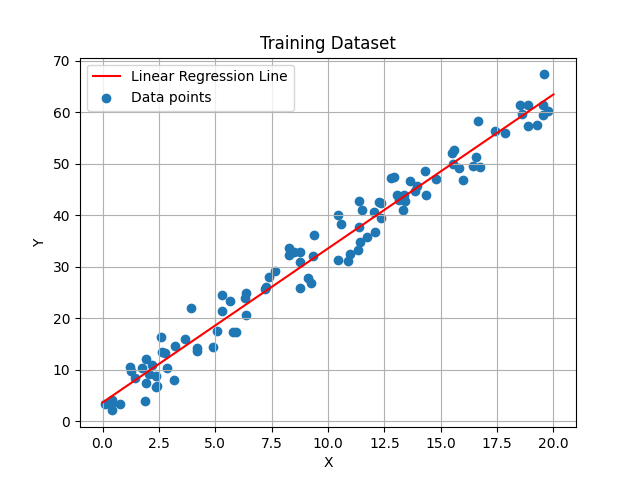
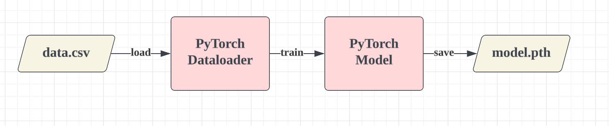
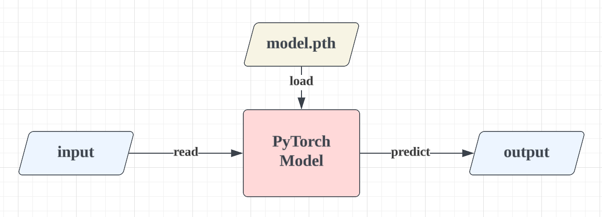

# PyTorch Model Tutorial

This repo shows a dead-simple example of serving a linear regression model with PyTorch.

## The Model

For learning purposes, the "model" is spilt into three concepts:

    - Initial Dataset
    - Training
    - Inference

#### Initial Dataset

The model is trained using an initial dataset generated by `./models/dataset/gen_data.py`.

The data looks like this:



#### Training

The model is trained using `./model/train.py`. The output of the training is a pre-trained serialized model saved in a `.pth` file.



#### Inference

We can now load the model `.pth` file and use it to make predictions. This is done in `./model/inference.py`.



Example:

```bash
$ python model/inference.py
enter value: 9.2
prediction:  24.539400100708008
```

## Serving the Model

torch-model-archiver -f \
    --model-name model \
    --export-path serve/ \
    --version 1.0 \
    --serialized-file model/model.pth \
    --extra-files "model/model.py" \
    --handler serve/handler.py

torchserve \
    --start --ncs \
    --model-store serve/ \
    --models model.mar \
    --log-config serve/log4j2.xml

torchserve --start --log-config /path/to/custom/log4j2.xml
